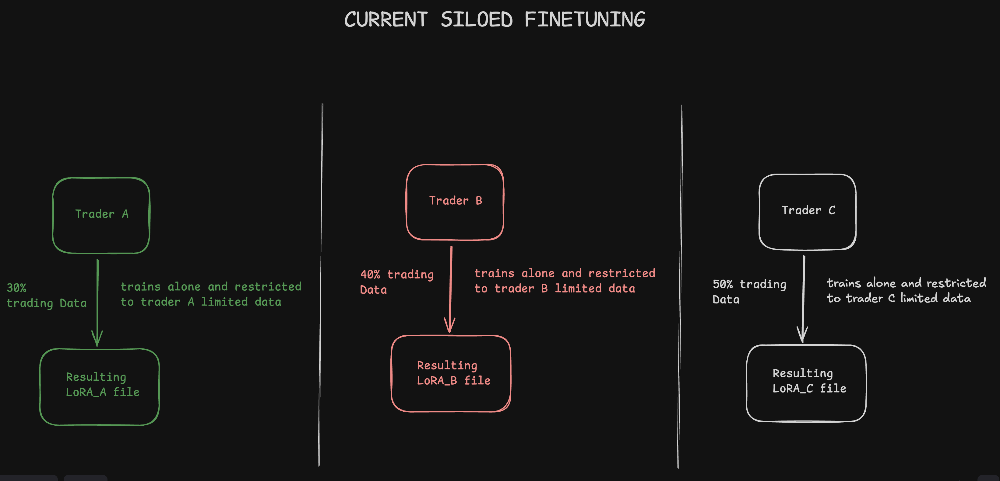
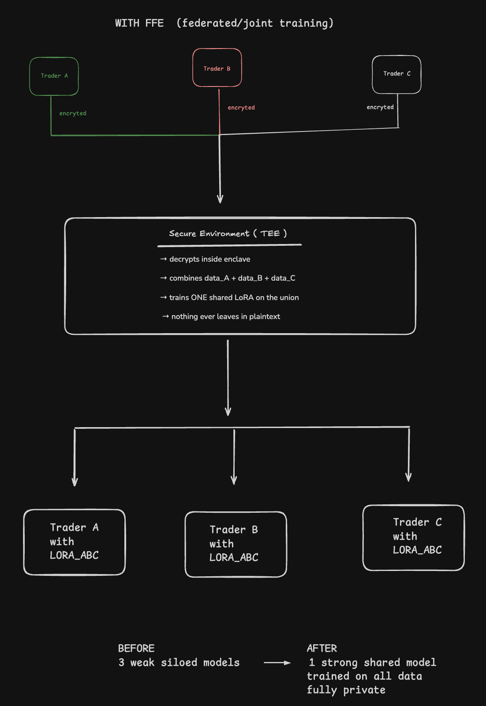

# FFE — Federated Fine-tuning Extension

> *From N=1 to N>1. Privately.*

A drop-in extension to **0G**'s fine-tuning network that takes it from
single-tenant (one user, one dataset, one private model out) to **multi-tenant
joint training** — where N parties co-train one shared LoRA without any of them
ever exposing raw data to each other or to 0G.

Built for the **Best Agent Framework, Tooling & Core Extensions** track of the
Open-Agent hackathon.

---

## TL;DR

0G's fine-tuning today is for **one user**. FFE extends it to **many**, without
anyone seeing anyone else's data.

- N parties encrypt their JSONL datasets to a TEE aggregator's pubkey
- The aggregator decrypts inside an attested enclave and trains **one shared LoRA**
- The result is minted as an **ERC-7857 INFT** with one `sealedKey` per contributor
- Everyone walks away with the same model — jointly owned, trained on all the data

---

## The problem (visual)

### Before — Current siloed fine-tuning

Each trader trains alone on their own slice of the data. Three weak,
narrow-view models.



> Trader A trains on 30% of the data → `LoRA_A`
> Trader B trains on 40% of the data → `LoRA_B`
> Trader C trains on 50% of the data → `LoRA_C`
> Nobody sees anyone else's data — but nobody benefits from it either.

### After — With FFE (federated / joint training)

All three encrypt their data to a TEE enclave. The enclave decrypts, combines,
and trains **one shared LoRA** on the union. Everyone gets the same strong model.



> **Before:** 3 weak siloed models.
> **After:** 1 strong shared model trained on all data, fully private.

---

## Architecture

### v1 — Joint Training mode

We deliberately picked the simpler architecture for v1. Federated rounds
(iterative LoRA-delta aggregation) are v2.

```
Contributor A  ──► encrypt JSONL_A to AggTEE pubkey ──► 0G Storage
Contributor B  ──► encrypt JSONL_B to AggTEE pubkey ──► 0G Storage
Contributor C  ──► encrypt JSONL_C to AggTEE pubkey ──► 0G Storage
                                                              │
                                                              ▼
                          ┌──────────────────────────────────────┐
                          │     Aggregator TEE (0G Tapp)         │
                          │  1. fetch encrypted blobs            │
                          │  2. decrypt inside enclave           │
                          │  3. Quality Gate per contributor     │
                          │  4. concat → train ONE LoRA          │
                          │  5. encrypt LoRA, seal keys per      │
                          │     contributor                      │
                          │  6. attest + sign                    │
                          └──────────────┬───────────────────────┘
                                         │
                                         ▼
                          ERC-7857 INFT minted on 0G Chain
                          owners: [A, B, C]
                          sealedKey per owner
                                         │
                ┌────────────────────────┼────────────────────────┐
                ▼                        ▼                        ▼
        Contributor A            Contributor B            Contributor C
        Base + LoRA_ABC          Base + LoRA_ABC          Base + LoRA_ABC
```

### Component map

| Layer | What it is | Approx size |
|---|---|---|
| **SDK** (`@0g/ffe`) | TS/Python library — three calls: `openSession`, `submit`, `download` | ~150 LoC |
| **CLI** | `npx ffe …` wrapper for non-developers | ~100 LoC |
| **Coordinator contract** | Solidity on 0G Chain — session lifecycle, hash commits, slashing | ~300 LoC |
| **INFT minter** | Wraps `0g-agent-nft` (ERC-7857) for multi-owner joint output | ~100 LoC |
| **Aggregator service** | Rust/Python in 0G Tapp enclave — fetch, decrypt, Quality Gate, train, encrypt | ~600 LoC |
| **Demo app** | 3 mock contributors, synthetic dataset, before/after metrics | ~300 LoC |

**Total: ~1,550 LoC.** The SDK is the visible deliverable — what other devs
`npm install` to plug FFE into their own apps.

---

## End-to-end flow (3-trader example)

| Time | Event |
|---|---|
| T+0 | Trader A opens session: `npx ffe session create --base Qwen3-32B --participants 0xA,0xB,0xC --quorum 3` |
| T+5 | Trader A encrypts data to aggregator pubkey, uploads to 0G Storage, commits hash on chain |
| T+8 | Trader B does the same |
| T+15 | Trader C submits → quorum hit → contract emits `QuorumReached` |
| T+15 | Aggregator service triggers; pulls blobs, decrypts in TEE |
| T+18 | Quality Gate runs — per-contributor mini-LoRA scored against held-out eval set; bad contributors filtered/slashed |
| T+20 | Joint LoRA trained on union of accepted data |
| T+45 | Post-training validation; LoRA encrypted, sealed keys generated per owner |
| T+46 | INFT minted; all 3 contributors notified |
| T+50 | Each contributor decrypts with their wallet key, loads `Base + LoRA_ABC` |

---

## Defense against bad data

Three layers, all required for v1.

### Layer 1 — Staked permissioned access
Every contributor locks a stake before joining. Bad behavior loses the stake.
Slashing is triggered by a TEE-signed rejection certificate posted on-chain.

```solidity
function joinSession(uint256 sessionId) payable {
    require(msg.value >= MIN_STAKE);
    require(whitelist[sessionId][msg.sender]);
    stakes[sessionId][msg.sender] = msg.value;
}

function slashWithProof(
    address contributor,
    bytes calldata rejectionCert,
    bytes calldata teeAttestation
) external {
    require(verifyTEESignature(rejectionCert, teeAttestation));
    uint256 amount = stakes[sessionId][contributor];
    stakes[sessionId][contributor] = 0;
    // distribute slashed stake to honest contributors
}
```

### Layer 2 — Quality Gate (pre-training filter, inside TEE)

```python
for contributor_i in contributors:
    mini_lora_i = train_lora(base, data_i, epochs=1)
    score_i    = evaluate(mini_lora_i, public_eval_set)

filtered = [i for i in contributors
            if score_i >= median(scores) - threshold]

# Slash filtered-out contributors via TEE-signed rejection cert
# Train joint LoRA only on `filtered` contributors' data
```

### Layer 3 — Post-training backstop
After joint training, the LoRA is benchmarked. If it fails to improve over the
solo baselines, the session aborts: contributors get partial refunds, the last
submitter loses extra stake. Catches sophisticated poisoning that slipped
through Layer 2.

---

## Cryptographic flow

**Encryption to aggregator on submit**
- Aggregator publishes its enclave pubkey + attestation quote on chain
- Each contributor verifies the attestation, then encrypts JSONL with X25519 to that pubkey
- Only this specific enclave (running this specific code) can decrypt

**Encryption of output to all contributors**
- TEE generates a fresh symmetric key `K`, encrypts LoRA with `K`
- For each contributor `i`: `sealedKey_i = encrypt(K, contributor_pubkey_i)`
- INFT mints with `[sealedKey_A, sealedKey_B, sealedKey_C]`
- Each contributor decrypts their `sealedKey_i` with their wallet key, recovers `K`, decrypts the LoRA

This is exactly what ERC-7857's `sealedKey` mechanism is designed for — we're
using the standard for the use case it was specced around.

---

## Repo layout

```
ffe/
├── sdk/             # @0g/ffe — TS library (openSession, submit, download)
├── cli/             # npx ffe wrapper
├── contracts/       # Coordinator + INFT minter (Solidity)
├── aggregator/      # TEE service (Rust/Python) — runs inside 0G Tapp
├── demo/            # 3-contributor demo app + synthetic dataset
└── docs/
    └── diagrams/    # before-siloed.png, after-ffe.png
```

---

## 0G primitives used

- **0G Tapp** — aggregator enclave with attestation
- **0G Compute (fine-tuning)** — underlying training (extends single-tenant → N-tenant)
- **0G Storage** — encrypted dataset blobs, encrypted LoRA output
- **ERC-7857 (INFT)** — co-owned encrypted model artifact, sealedKey per owner
- **Sealed Inference (TeeML / TeeTLS)** — private serving of trained model
- **0G Chain** — coordinator contract, INFT minter, slashing, settlement

---

## Build plan (4 weeks)

### Phase 0 — De-risk (Days 1–4)
- Run 0G's `fine-tuning-example` end-to-end on testnet
- Deploy hello-world Tapp enclave; verify attestation externally
- Mint vanilla ERC-7857 INFT with two `sealedKey` entries; confirm both owners decrypt independently
- Measure Tapp GPU/RAM ceiling; pick base model accordingly

### Phase 1 — Walking skeleton (Days 5–9)
Single-contributor end-to-end: SDK `openSession` + `submit` + `download`,
minimal Coordinator (`createSession`, `submit`, `QuorumReached`), aggregator
that fetches → decrypts → trains → encrypts.

### Phase 2 — Multi-tenant joint training (Days 10–14)
N participants, whitelist + quorum, multi-owner INFT with N sealedKeys.
**Core thesis is now demoable.**

### Phase 3 — Skin in the Game (Days 15–19)
Stake + slash, TEE rejection certificates, Quality Gate, post-training backstop.

### Phase 4 — Demo + polish (Days 20–28)
Demo app UI, synthetic dataset that visibly benefits from pooling, Galileo
testnet deployment, <3-min demo video, submission checklist.

### Cuts if behind (in order)
1. Layer 3 post-training backstop
2. Automatic slashing (keep stake-locking; slash manually for demo)
3. Quality Gate degraded to data-size sanity checks
4. Drop to 2 contributors instead of 3
5. Drop CLI; SDK + demo app only

**Don't cut:** multi-owner INFT, encrypted-to-enclave submit, end-to-end demo.
Those *are* the pitch.

---

## Roadmap

### v1 — hackathon ship
Joint Training mode • permissioned + staking • Quality Gate •
post-training validation • TEE-signed rejection certs • multi-owner INFT •
SDK + CLI + reference aggregator + demo.

### v2 — Federated mode + privacy
Multi-round LoRA-delta aggregation • differential privacy • async / dropout-tolerant
rounds (M-of-N quorum) • robust aggregation (median, trimmed-mean, Krum).

### v3 — Ecosystem
Reputation registry (ERC-8004) • skill marketplace integration •
OpenClaw extension (`@0g/ffe-openclaw`) • cross-base-model support beyond Qwen.

---

## Use cases

1. **Cross-trading-desk slippage / market-impact model** — prop desks pool fill
   data without exposing strategies. Strong fit for 0G's crypto-native audience.
2. **Enterprise cross-department LLM** — compliance-blocked silos contribute privately.
3. **DeFi cross-protocol exploit / risk model** — protocols pool exploit patterns.
4. **Pharma / research consortia** — labs pool trial outcomes without leaking IP.
5. **Community-trained models** — trustless Outlier/Scale; data co-ops own the upside.
6. **Rare-disease diagnostic models** — regional hospitals pool clinical notes
   without violating HIPAA. Best demo pick for the 3-min video.

---

## Open questions

1. **Fine-tuning is testnet-only on 0G today.** Hackathon ships on testnet;
   mainnet is a downstream dependency on 0G's roadmap.
2. **Tapp memory/GPU limits.** Need to confirm a Tapp instance can train
   Qwen3-32B's LoRA on a few-thousand-sample joint dataset. Fallback: Qwen2.5-0.5B.
3. **Aggregator pubkey publishing pattern.** Contributor must verify the TEE
   attestation matches the published code hash before encrypting.
4. **ERC-7857 sealedKey for multi-party output.** Standard is designed for
   transfer between two parties; we use the same mechanism for N-party initial
   mint. Worth confirming with the 0G team.
5. **Sophisticated data poisoning is an open research problem.** Quality Gate
   catches obvious cases; v1 doesn't claim Byzantine robustness.

---

## Submission checklist

- [ ] Public GitHub repo with README + setup instructions
- [ ] Architecture diagrams (before / after / usage)
- [ ] Coordinator + INFT minter deployed on Galileo testnet
- [ ] Demo video under 3 minutes
- [ ] Live demo link
- [ ] Working example agent built using FFE
- [ ] Team contacts (Telegram/X)
- [ ] List of 0G protocol features / SDKs used

---

## References

- **ERC-7857 (INFT)** — co-owned encrypted-artifact NFT standard with `sealedKey`
- **0G Tapp** — TEE enclave runtime with attestation
- **0G Compute / Fine-tuning** — single-tenant LoRA training (the primitive FFE extends)
- **0G Storage** — content-addressed encrypted blob store
- **0G Chain** — settlement layer for the Coordinator + INFT minter
- **Sealed Inference (TeeML / TeeTLS)** — private serving for the resulting model
- **LoRA: Low-Rank Adaptation of Large Language Models** — Hu et al., 2021
- **Federated Learning** — McMahan et al., 2017 (the literature FFE productizes onto 0G)

---

*Working name: **FFE** — Federated Fine-tuning Extension.*
*Pitch: 0G's fine-tuning today is for one user. FFE extends it to many — without anyone seeing anyone else's data.*
